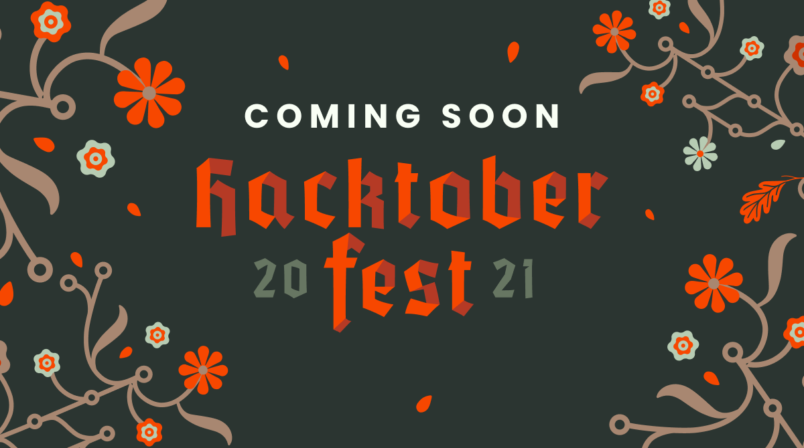

<p align="center">
  <a href="https://hacktoberfest.digitalocean.com/">
    <h2 align="center">HACKTOBERFEST 2021</h2>
  </a>
</p>
<p align="center">Open source is changing the world – one contribution at a time.</p>

<div align="center">


</div>

# Hacktoberfest'21 Practice Contribution

Hacktoberfest is a month long event where people are awarded for contributing to open source projects 🙌, and we're joining the party .Hosted by DigitalOcean for the 8th year in a row, Hacktoberfest encourages participation in giving back to the open source community by completing pull requests, participating in events, and donating to open source projects.

<b>This repo is <u>not</u> included in the Hacktoberfest event, as it is for practice only</b>

We have other repositories in the organisation you can contribute to. If you would like to join our GitHub organisation, raise an issue on this repo.

---

# Hacktoberfest Practice Pull Requests

Repo for you to raise a Pull Request for practice.

**Just add your name, Linkedin url, or other social media link on HTML file**

## How to contribute

1. Fork the project
2. Make any changes in your forked repo
3. On this repo, click `Pull Requests` and raise a `Pull Request` selecting your fork on the right drop down

Questions can be asked by raising an `Issue`.

# Instructions

- Clone your forked repository to your pc ( git clone "url from clone option.)		
- Create a new branch for your modifications (ie. `git branch new-user` and check it out `git checkout new-user` and `git checkout -b new-user`)		
- Add your profile image in `static/images/` ( use drag and drop option or upload by commands.)		
- Add your profile data in `content/participant/`		
- Add your files (`git add -A`), commit (`git commit -m "added myself"`) and push (`git push origin new-user`)		
- Create a pull request		
- Star this repository

## How to make your first Pull Reques

Replace `<YOUR-USERNAME>` with your GitHub username in this guide.

#### 1. Add your profile picture to the folder

Add a profile picture of your choice in `static/images/`. Accepted files are **png** and **jpg**, should be squared and minimum size 544x544 pixels. Ex.		

 ```		
static/images/<YOUR-USERNAME>.png		
```		

 _Be aware, this picture will be displayed on the yearbook!_		

 #### 2. Add your profile information		

 Create a markdown file in your folder following the convention `content/participant/<YOUR-USERNAME>.md`. Ex.		

 ```		
content/participant/<YOUR-USERNAME>.md/		
```		

 Copy the next template into your file, delete the boilerplate data and fill the information with yours.		

 ```		
---		
name: YOUR_NAME		
institution: INSTITUTION_NAME		
image: PROFILE_PICTURE_FILENAME		
quote: YOUR_QUOTE		
github: USERNAME		
---		
```		

 _Do not use special characters in the template above._		

 #### 4. Wait for Pull Request to merge		

 #### 5. Celebrate - you've done your first pull request!!🎉

 <div align="center">

 ### ❤️ Project Admin

 <table>
 	<tr>
 		<td align="center">
 			<a href="https://github.com/aryasoni98">
 				
 				<br /> <sub><b>Arya Soni</b></sub>
 			</a>
 			<br /> <a href="https://github.com/aryasoni98">
 		   👑
 	    </a>
 		</td>
 	</tr>
 </table>

### 🌟 Contributors

### Thanks goes to these wonderful people ✨✨:

<table>
	<tr>
		<td>
       <a href="https://github.com/aryasoni98/Hacktoberfest2021/graphs/contributors">
       
       </a>
		</td>
	</tr>
</table>
</div>
